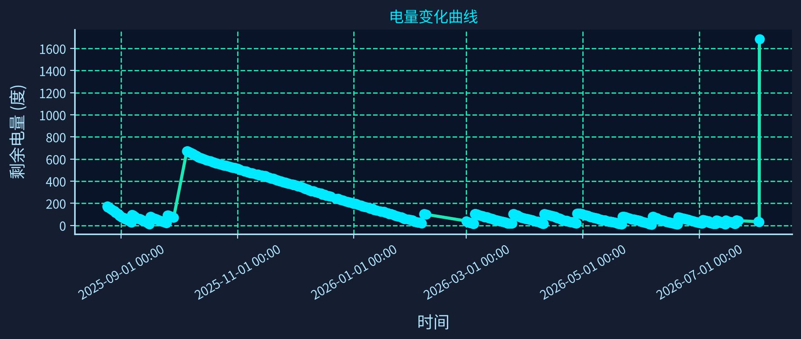
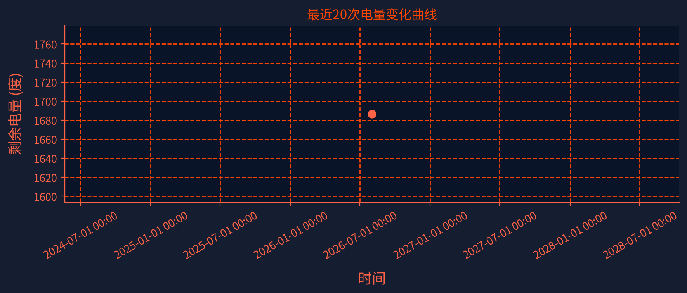

# ⚡ 南京大学电费监控面板

> 自动追踪宿舍电量消耗，可视化用电趋势，智能预测余额可用天数

🌐 **在线体验**: [https://chen-rong-zi.github.io/nju_electric_monitor/](https://chen-rong-zi.github.io/nju_electric_monitor/)

---

## 📊 功能特性

- **实时电量监控** — 自动采集宿舍剩余电量数据
- **用电趋势分析** — 电量变化曲线，支持 7天/30天/90天/全部时间范围
- **每日用电量** — 柱状图展示每日用电量分布
- **智能预测** — 基于近 7 天用电习惯，预测余额何时用完
- **用电高峰分析** — 识别高峰用电时段和高峰日
- **数据明细** — 完整的电费数据表格，支持展开/折叠

## 🛠 技术栈

| 组件 | 技术 |
|------|------|
| 前端 | 纯 HTML/CSS/JS，无需后端 |
| 图表 | Plotly.js（交互式图表） |
| 数据采集 | Python + Selenium（GitHub Actions 自动运行） |
| 部署 | GitHub Pages |

## 📈 自动采集图表

> 以下图表由 GitHub Actions 自动采集数据并生成，每次运行自动更新。

### 电量变化趋势



### 最近 20 次电量变化



---

## 📄 数据说明

- **数据来源**：南京大学 epay 电费充值系统
- **更新频率**：每日多次自动采集
- **数据格式**：`data/electricity_data.json`（JSON Lines）
- **数据安全**：仅采集电量余额数据，不涉及个人身份信息

## 📂 项目结构

```
nju_electric_monitor/
├── docs/index.html          # GitHub Pages 静态面板
├── src/                     # Python 采集脚本
├── data/                    # 电量数据
├── .github/workflows/       # 自动采集工作流
└── README.md                # 本文件
```

## 📜 许可证

MIT License

---

<p align="center">
  ⚡ 南京大学电费监控 · 开源项目
</p>